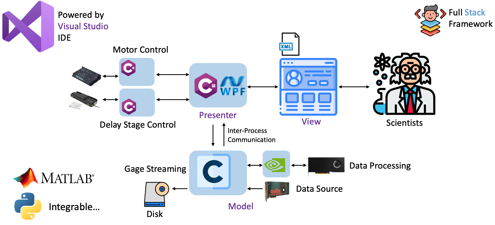
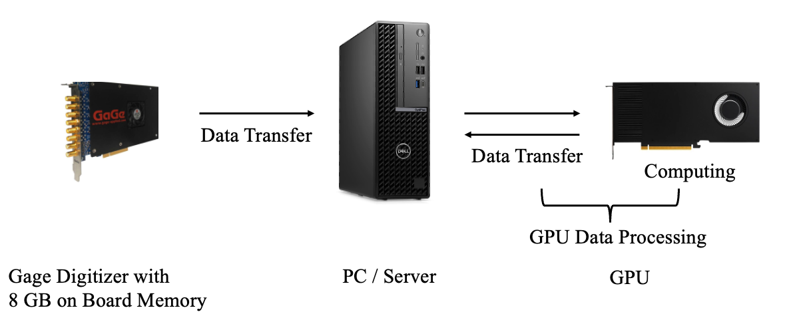
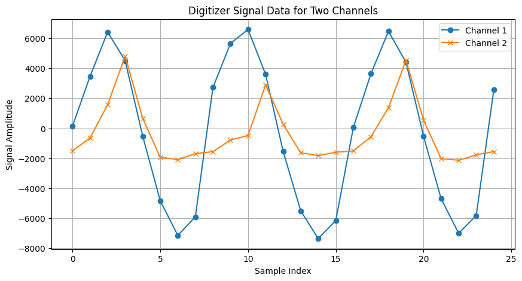
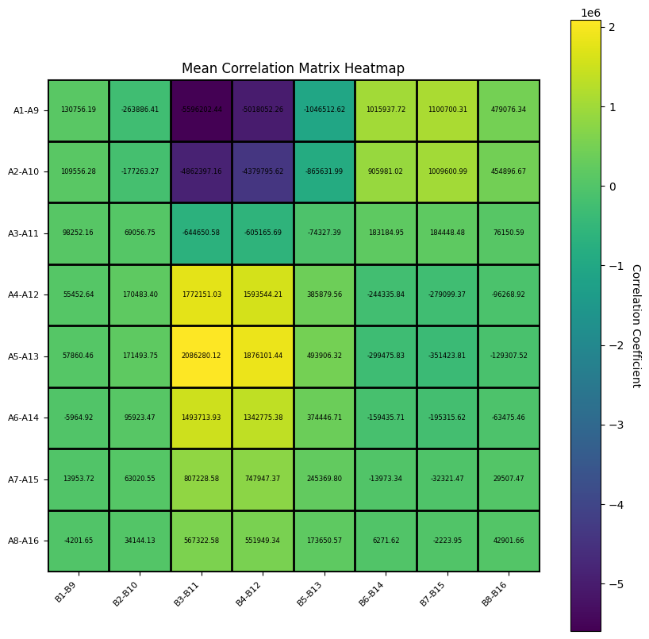

# QuantaMeasure Documentation

# Introduction

Welcome to the official documentation for **QuantaMeasure**, a software solution designed to provide scientists with efficient tools for real-time viewing and analysis of measured quantum signals.

This documentation is intended for scientists with a foundational knowledge of computer science, offering guidance on understanding the codebase, as well as providing instructions and insights for maintaining and updating the software’s functionalities.

## **Live Demo**
See QuantaMeasure in action! Watch the live demonstration  to explore the key features and workflows.

  

# Table of Contents

- [Introduction](#introduction)
- [Overview](#overview)
  - [Quantum Measurement UI](#quantum-measurement-ui)
  - [GageStreamThruGPU](#gagestreamthrugpu)
  - [Other Projects [MotorMove]](#3-other-projects-motormove)
- [Software Development](#software-development)
  - [Main Components](#main-components)
  - [UI Components](#ui-components)
  - [Workflow](#workflow)
  - [Data Update Logic](#data-update-logic)
  - [UI Thread and Worker Threads](#ui-thread-and-worker-threads)
  - [Event Handlers for Buttons](#event-handlers-for-buttons)
  - [Asynchronous Programming](#asynchronous-programming)
- [Data Acquisition and Processing System](#data-acquisition-and-processing-system)
  - [System Workflow](#system-workflow)
- [CUDA Programming for Data Processing](#cuda-programming-for-data-processing)
  - [Mathematical Definitions Behind Cross-Correlation](#mathematical-definitions-behind-cross-correlation)
  - [CUDA Programming](#cuda-programming)
    - [CUDA Programming Basics](#cuda-programming-basics)
    - [CUDA Program Design for Cross-Correlation Matrices](#cuda-program-design-for-cross-correlation-matrices)
    - [Recommended Learning Resources](#recommended-learning-resources)
- [Project and Process Connections](#project-and-process-connections)
  - [Project Reference](#project-reference)
  - [Process Communication via Named Pipe](#process-communication-via-named-pipe)
    - [Communication Logic](#communication-logic)
    - [Efficiency and Extensibility](#efficiency-and-extensibility)


# Documentation Roadmap

1. [Overview](#overview): Introduces the entire code structure, covering the frontend UI, the data acquisition and processing backend, and how these components connect efficiently.
2. [Software Development](#software-development): Explains the development of the Windows Presentation Foundation (WPF) application, including environment setup, component integration, and the visualization libraries used.
3. [Data Acquisition and Processing System](#data-acquisition-and-processing-system): Details the data acquisition process via the Gage digitizer and outlines data processing configurations.
4. [CUDA Programming for Data Processing](#cuda-programming-for-data-processing): Provides a basic introduction to CUDA programming along with a detailed explanation of the CUDA code utilized.
5. [Project and Process Connections](#project-and-process-connections): Provides a technical overview of how components are seamlessly connected, along with guidance on integrating additional components in the future.


# Overview


*Figure 1: Codebase Structure*

### Figure 1 Explanation

In *Figure 1: Codebase Structure*, the bottom section labeled "Gage Streaming" corresponds to the **GageStreamThruGPU** project, where data acquisition via the Gage digitizer and GPU-based data processing occur. The "Presenter" section (using WPF and C#) and "View" (using XAML) correspond to the **Quantum Measurement UI** project, which handles frontend visualization and coordination. On the left side, "Motor Control" and "Delay Stage Control" represent additional components, such as **MotorMove**, which can be integrated into the system. These components are introduced in detail below.


The codebase adopts the **MVP (Model-View-Presenter)** architecture. In this structure:

- **View**: The frontend visualizes all components displayed to the user via a graphical user interface (GUI). The view is built using XAML, which serves as a canvas for designing and organizing UI components.
- **Model**: The core of the project where data generation and computations occur.
- **Presenter**: Coordinates the interaction between the model and view, handling communication and data flow.

If the MVP structure seems unclear, you may skip understanding its specifics; the descriptions of the code components below will help clarify the overall structure and functionality.

In **Visual Studio**, the codebase is organized as a **solution** that contains multiple **projects**. 

- **Solution**: A container for organizing related projects, providing a unified structure for building and managing the entire application.
- **Project**: Each project within the solution focuses on a specific part of the application, such as the UI or data processing, making the codebase modular and easier to maintain.

In this codebase, the solution contains two main projects: 
- **Quantum Measurement UI**: Responsible for the frontend, visualization, and coordinating with other components to receive and display data on the UI.
- **GageStreamThruGPU**: Handles data acquisition and GPU-based processing for real-time performance.


### 1. Quantum Measurement UI

The **Quantum Measurement UI** project uses WPF (Windows Presentation Foundation) to build the entire software interface, including the frontend UI and basic data visualization presenter. The primary files in this project are:

- **`MainWindow.xaml`**: Defines the user interface layout and elements for the main application window. XAML code here acts as a canvas for arranging components and adjusting their layout.
- **`MainWindow.xaml.cs`**: The **code-behind file** for `MainWindow.xaml`, containing the C# code that defines the logic and functionality of the UI elements declared in `MainWindow.xaml`. While `MainWindow.xaml` is responsible for the layout and structure, `MainWindow.xaml.cs` handles the interactive behavior and application logic.

### 2. GageStreamThruGPU

The **GageStreamThruGPU** directory manages data acquisition and GPU-based processing. It initiates the digitizer for data collection and performs real-time data processing. Key files include:

- **`StreamThruGPU_Simple.c`**: The main code file for data acquisition and processing. This file handles the primary workflow of collecting and preparing data for analysis.
- **`DSPEquation_Simple.cu`**: A CUDA file that defines the logic for GPU-based data processing. Functions from this file are called within `StreamThruGPU_Simple.c` to perform high-performance computations on the data.
- **`DSPEquation_Simple_CPU.c`**: This file defines the data processing logic in a single-threaded, CPU-based way. It serves as a verification tool to ensure the correctness of the CUDA processing logic.


### 3. Other Projects [MotorMove]

The codebase solution also supports integrating additional components, such as APIs for controlling experimental instruments. For example, the **MotorMove** project includes `MotorControl.cs`, which manages the motor controller.

This project is standalone with its own environment setup, allowing seamless integration. By using Visual Studio’s **project reference** feature, we can directly access classes and functions defined in this project from other parts of the solution. This approach eliminates the need to modify the environment of any project that references it. Details on how project references work will be covered in the **Project and Process Connections** section.


# Software Development

We use Visual Studio 2022 as the Integrated Development Environment (IDE) to develop the Windows Foundation Application in C#. The software development code resides in the Quantum Measurement UI project.

The key components of the code are:

- **MainWindow.xaml**: Defines the layout of the application, including the charts, buttons, and overall graphical user interface (GUI).
- **MainWindow.xaml.cs**: Implements the backend logic of the application and links the backend to the frontend UI defined in MainWindow.xaml.

### Main Components

1. **MainWindow.xaml**:
   - This file specifies the structure and layout of the UI elements, such as buttons, tabs, charts, and other GUI components.
   - The application consists of two primary tabs/pages, as defined in this file.

2. **MainWindow.xaml.cs**:
   - This file contains the logic to handle events, manage data, and update the UI components dynamically.
   - It acts as a bridge between the backend and the UI, binding data and logic to the elements defined in MainWindow.xaml.

In C#, which is an object-oriented programming language, everything is encapsulated within classes. The `MainWindow` class is directly bound to `MainWindow.xaml`, so UI components defined in `MainWindow.xaml` can be accessed and manipulated in the `MainWindow` class.

---

## Workflow

The application operates on a UI thread, which is responsible for rendering the UI components. The UI thread automatically updates the visible elements. In addition to the UI thread, worker threads handle background tasks such as data updates and computations to ensure smooth performance.

### Connection to External Process

The application integrates with the **GageStreamThruGPU** process, which controls the GaGe Digitizer for data acquisition and utilizes the GPU for data processing. This external process periodically sends data, including signal streams and cross-correlation matrices, to the UI application. The received data is used to update the charts and other UI elements in real time.

---

## UI Components

We use the **LiveCharts** library to display charts in the application. After initializing LiveCharts, the chart UI updates automatically based on the underlying data. For instance:

- **LineSeries** objects represent the chart data in the code.
- The background logic updates the values of these objects, and the changes are reflected on the UI automatically.

---

## Data Update Logic

Two global buffers, `dataBuffer` and `corrMatrixBuffer`, store the signal data and cross-correlation matrix data, respectively. The application periodically receives data from the **GageStreamThruGPU** process and updates these buffers.

### Asynchronous Data Updates

The `UpdateData` asynchronous task is responsible for periodically updating the chart values using data from the `dataBuffer` and `corrMatrixBuffer`. This ensures the UI reflects the latest data without blocking other operations.

Example:

```csharp
Task.Run(() => UpdateData(cancellationTokenSource.Token));
```

Here, `UpdateData` runs on a thread pool to prevent overloading the UI thread.

---

## UI Thread and Worker Threads

- **UI Thread**:
  - Handles rendering the UI components and initial application setup.
  - Ensures a responsive and smooth user experience.

- **Worker Threads**:
  - Perform background computations and data updates.
  - Prevent the UI thread from becoming overloaded, ensuring the application remains responsive.

Using `Task.Run()`, we delegate background tasks to worker threads. This allows the application to handle intensive operations asynchronously while keeping the UI responsive.

---

## Event Handlers for Buttons

The application includes several buttons connected to event handlers defined in `MainWindow.xaml.cs`. The connection between a button and its event handler is explicitly declared in `MainWindow.xaml`. For example:

```xml
<Button Content="Start" Click="StartMotionButton_Click" />
```

The `Click="StartMotionButton_Click"` specifies that the `StartMotionButton_Click` method in `MainWindow.xaml.cs` will execute when the button is clicked.

---

## Asynchronous Programming

Asynchronous programming is widely used in the application. Methods marked with `async` allow the application to initiate tasks without waiting for their completion. This ensures non-blocking execution and a smoother user experience.

For example:

```csharp
async Task SomeFunctionAsync()
{
    await Task.Delay(1000); // Simulate some work
    // Continue execution without blocking
}
```

In the context of the application, asynchronous programming is essential for handling data updates and background computations without disrupting the UI rendering process.

---


# Data Acquisition and Processing System

The system workflow is depicted in *Figure 4*. The computer is connected to the GaGe Digitizer for data acquisition and the GPU for data processing. The program controlling Data Acquisition and Data Processing is in [StreamThruGPU_Simple.c](./GageStreamThruGPU/StreamThruGPU_Simple.c).

The Data Acquisition and Processing System operates as a single process and sends the data and computed results to the software process.

  
*Figure 4: System Workflow*

**Note:**  
The code is built based on the official code from the GaGe Digitizer company. Within the code, the digitizer is controlled by APIs provided by GaGe. API functions can be reviewed in the documentation of GaGe CsAPI.

---

## System Workflow

Within the program, the GaGe digitizer is initialized and configured using an [INI file](./GageStreamThruGPU/StreamThruGPU.ini) (configuration file). The configuration file sets up digitizer parameters such as the sampling rate, internal or external clocking, and GPU computing settings in the `ExpConfig` section.

In the computer's RAM, two buffers are allocated and pinned to store data from the digitizer. The digitizer transfers one batch of data (e.g., 64 MB) to one buffer in the computer's RAM at a time. These two buffers work in tandem to ensure efficient operation:

1. While one buffer receives data from the digitizer, the other buffer sends previously received data to the GPU for processing.
2. In the next step, the roles of the buffers swap: the buffer that just finished processing data begins receiving new data, while the other buffer processes its previously received data.

This alternating and concurrent operation ensures continuous data flow and processing, effectively doubling the system's speed.


As the PC/Server receives the data in the RAM buffer, it sends the data to the GPU for processing. In [StreamThruGPU_Simple.c](./GageStreamThruGPU/StreamThruGPU_Simple.c), the program directly calls the function defined in the CUDA file `ComputeCrossCorrelationGPU`.

---

# CUDA Programming for Data Processing

This section introduces CUDA programming for computing the cross-correlation matrix. The discussion begins with the mathematical foundations of cross-correlation computation, followed by detailed explanations of the CUDA programming aspects and performance analyses for CUDA optimizations.

## Mathematical Definitions Behind Cross-Correlation

For each batch of data, the data is segmented into smaller segments, with each segment consisting of 32 data points from two channels—Channel A and Channel B. For each segment, one cross-correlation matrix is computed, and then all computed cross-correlation matrices are averaged to obtain the overall cross-correlation matrix for the batch.

A single segment of data is arranged as:

$$
[A_1, B_1, A_2, B_2, \ldots, A_{16}, B_{16}]
$$

where \( A \) and \( B \) denote the channels. *Figure 2: Signals* depicts the signals from the digitizer, illustrating that each segment of data consists of two channels, and for each channel, one segment captures two pulses of waves. The cross-correlation is computed between the two channels of signals within one segment.


*Figure 2: Signals*

The cross-correlation between the two channels within one segment is defined as:

$$
C_{i,j} = \left( A_i - A_{i+8} \right) \times \left( B_j - B_{j+8} \right)
$$

where \( i, j \) range from 1 to 8. The matrix is visualized below in *Figure 3: Cross-Correlation Matrix*.


*Figure 3: Cross-Correlation Matrix*

After computing all cross-correlation matrices for one batch of data, the matrices are averaged to obtain the mean cross-correlation matrix:


<div align="center">
  
</div>


where \( N \) is the total number of segments.

For one batch of data—for example, with 1 million segments—the final result is a mean cross-correlation matrix consisting of 64 elements.

Note: [Correlation_Matrix_Computation.pdf](./GageStreamThruGPU/Correlation_Matrix_Computation_Math.pdf) gives a detailed mathematical formulation for computing the mean cross-correlation matrix here.


## CUDA Programming

The CUDA programming was used to compute the mean cross correlation matrix for batchs of data. CUDA programming used will be introdcued in the section.

The basics of CUDA programming are introduced first, followed by the design of the CUDA program at the kernel level and a discussion of memory optimization techniques. Finally, recommended learning resources are introcued to speed learning curve.


### CUDA Programming Basics

CUDA is a parallel programming platform developed by NVIDIA. It provides extensions to C++ that allow developers to write code for high-performance computing on NVIDIA GPUs. CUDA compiles these programs into instructions that run on the GPU.

#### Key Concepts:
1. **Kernels**: Functions that define tasks to be executed on the GPU. Kernels are launched with multiple threads working in parallel on independent data (usually).
2. **Threads**: In CUDA, threads perform the same task on different pieces of data. CUDA is best suited for tasks where computations on data are independent, such as computing cross-correlation matrices.
3. **Heterogeneous Computing**: The GPU operates as a separate computing unit, connected to the host system via high-speed connections like PCIe. To perform computations, data must be transferred from the host system (CPU/RAM) to GPU memory.

#### Optimization Focus:
- **Thread Design**: Effective design of threads to maximize parallelism.
- **Memory Management**: Minimizing the overhead of memory transfers between the host and the GPU. This includes optimizing the use of GPU memory hierarchy and data placement.

### CUDA Program Design for Cross-Correlation Matrices

The CUDA program is located in: [DSPEquation_Simple_GPU.cu](./GageStreamThruGPU/DSPEquation_Simple_GPU.cu)


#### Kernel Design:
To compute the mean cross-correlation matrix for a batch of data, two steps are performed:
1. **Compute Cross-Correlation Matrices**: 
   - **Kernel Name**: `demodulationCrossCorrelation`
   - **Thread Mapping**: Each thread computes a single element of the cross-correlation matrix for one segment.
   - **Parallelism**: A total of `#segments * 64` threads are launched, where 64 is the size of the correlation matrix. This high number of threads helps achieve *latency hiding* (minimizing idle time).

2. **Average the Matrices**:
   - **Kernel Name**: `averageCrossCorrelation`
   - **Thread Mapping**: Threads reduce the results by averaging the computed matrices across segments.

#### Memory Management:
GPU memory management plays a critical role in performance optimization. CUDA offers a hierarchical memory model:
- **On-Chip Memory**: L1 and L2 cache, closer to compute cores, providing faster access.
- **Off-Chip Device Memory**: Slower but has larger capacity.
- **Host Memory**: RAM on the CPU side, connected to the GPU via PCIe.

For this project, memory optimizations include:
1. **Mapped Memory**:
   - Mapped memory allows the GPU and CPU to share a virtual address space, enabling direct data transfers between host and GPU memory without storing data in off-chip device memory.
   - This approach minimizes latency, as data is transferred directly to the compute cores.
   - Refer to NVIDIA's *CUDA C++ Programming Guide* for more details.

2. **Page Locked Memory**:
   - Memory on computer RAM is page locked to prevent the memory swapped out of RAM to disk, to make memory transfer between compyter and GPU stable.

### Recommended Learning Resources:
- [NVIDIA CUDA C Programming Guide](https://docs.nvidia.com/cuda/cuda-c-programming-guide/)
- [CUDA Training Series](https://www.olcf.ornl.gov/cuda-training-series/)

# Project and Process Connections


In Visual Studio, our solution currently contains three projects: **Quantum Measurement UI**, **GageStreamThruGPU**, and **MotorMove**. The **MotorMove** project is responsible for controlling the motor controller.
Projects can be connected via proejct reference or named pipes.


## Project Reference

Both **Quantum Measurement UI** and **MotorMove** are C# projects. Since they share the same programming language, we can utilize Visual Studio's project reference feature to connect them. 

For example, in the **Quantum Measurement UI** project, if we want to use classes from **MotorMove**, we can do the following:

1. Right-click on the **Quantum Measurement UI** project in the solution explorer.
2. Select **Add** > **Project Reference**.
3. Choose the **MotorMove** project to add as a reference.
4. Build the solution, and you can directly use the classes and APIs from **MotorMove** in your code.

This feature is particularly convenient because many vendors provide pre-built .NET C# projects. By integrating these projects into the solution and adding project references, we can seamlessly use their classes and APIs without additional setup.

**Note:**  
Project references only work for projects using the same language. For instance, a C# project cannot reference a C++ project.

---

## Process Communication via Named Pipe

For projects or processes using different programming languages, such as **GageStreamThruGPU** and **Quantum Measurement UI**, we use **named pipes** to establish communication.

### What is a Named Pipe?

A named pipe is a mechanism that provides inter-process communication (IPC). It operates as a **FIFO (First In, First Out)** buffer with a specific name. Named pipes allow a server and clients to communicate by writing to and reading from this shared buffer.

For example:
- A client writes a request into the pipe.
- The server reads the request, processes it, and sends a response back.

Once a request is read, it is removed from the pipe.

---

### Communication Logic

1. **Server**:
   - The server creates the named pipe and waits for the client to connect.
   - Periodically checks for client requests (e.g., during data acquisition and processing steps).
   - Responds to client requests, such as sending data.

   In the server, we implement these functionalities in [`pipe.cpp`](./GageStreamThruGPU/pipe.cpp):
   - **`createAndConnectPipe`**: Used to create the pipe and wait for client connections.
   - **`handleClientRequests`**: Used to check for client requests and respond accordingly (e.g., sending data).

2. **Client**:
   - The client creates a named pipe with the same name as the server's and connects to it.
   - Sends requests by writing to the pipe and waits for the server's response.

   Example client code:
   ```csharp
   pipeClient = new NamedPipeClientStream(".", PipeName, PipeDirection.InOut);
   pipeClient.Connect();

   // Send a request to the server
   byte[] request = BitConverter.GetBytes((short)2);
   await pipeClient.WriteAsync(request, 0, request.Length);

   // Receive data from the server
   byte[] dataBufferBytes = new byte[DataPoints * sizeof(short)];
   byte[] corrBufferBytes = new byte[64 * sizeof(double)];

   int bytesRead = await pipeClient.ReadAsync(dataBufferBytes, 0, dataBufferBytes.Length);
   int corrBytesRead = await pipeClient.ReadAsync(corrBufferBytes, 0, corrBufferBytes.Length);
   ```

---

### Efficiency and Extensibility

Named pipes are an efficient method for process communication and can be extended to support other types of processes. For instance:
- Programs written in **MATLAB** or **Python** can also communicate with our software using named pipes by following a similar approach.

This flexibility allows for seamless integration of processes written in different programming languages with our existing system.

---
